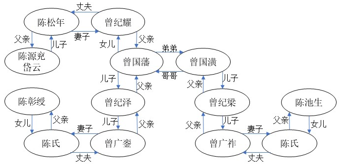

# 华谱通代码片段

## 1. 安装环境

### 1.1. 结巴分词库

`pip install jieba`

### 1.2. Jena环境配置

详见`/Jena/README.md`

## 2. 问答案例

### 2.1. 多条件匹配机制

执行`qa.demo.py`中[match_same_people_intro()代码片段](https://github.com/lazyloafer/Huaputong/blob/c160baec5c0bc4f6503cfe2a4ecb3da5b1808d6f/qa_demo.py#L922)

## 2.2. 路径排序

执行`qa.demo.py`中[qa_interface.find_user_path_user_heap_sorting()代码片段](https://github.com/lazyloafer/Huaputong/blob/c160baec5c0bc4f6503cfe2a4ecb3da5b1808d6f/qa_demo.py#L926C11-L926C56)
